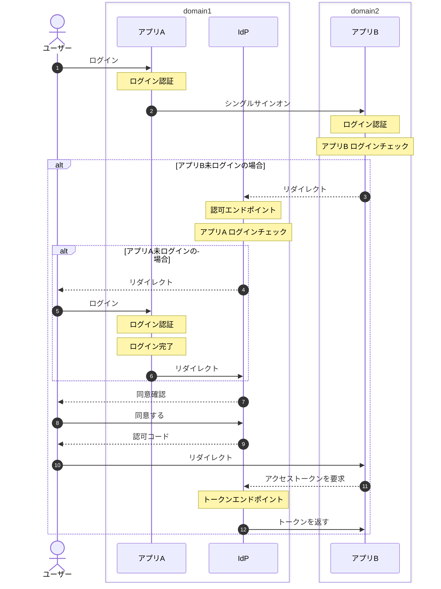

# ポートフォリオ
Java 実装集

## jaxrs-ddd

jakartaEE の JAX-RS および DDD(ドメイン駆動設計) アプリケーションの実装例。

Embedded GlassFish Server を使った簡易サーバーでのアプリケーション起動、Derbyを使った組み込みデータベース、JPA(EclipseLink)実装、Java標準機能を使ったプロキシ設定済みのHTTPクライアントや、暗号／複合の実装など。

## sso-proto

シングルサインオンの実装例

## JEP330

JEP330 (Launch Single-File Source-Code Programs)を使用した便利なツール実装例。

Javaソースを事前コンパイルしないで直接実行するため、スクリプトのように手軽に実行できます。Java標準APIのみを使ったシンプルな利用であれば非常に簡単に利用できます。

